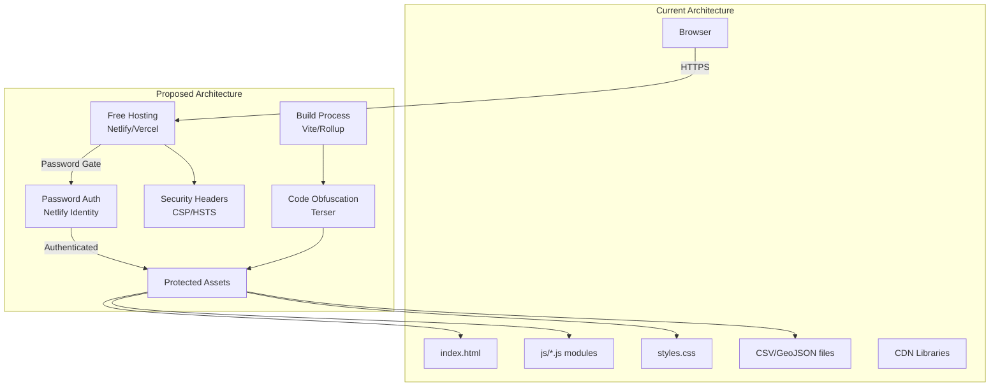

# DevOps & Security Architecture Plan

## Current State Analysis

The application is a **pure client-side vanilla JavaScript application** with:

- No backend/server infrastructure
- Static HTML/CSS/JS files
- Data loaded from CSV and GeoJSON files
- CDN dependencies (D3.js, Leaflet, Chart.js)
- No build process or bundling
- No authentication or access controls
- Code is easily inspectable via browser DevTools

**Key Files:**

- `index.html` - Main entry point
- `styles.css` - All styles
- `js/*.js` - Application modules (30+ files)
- `data/*.csv` and `Voting_Precincts.geojson` - Data files
- `package.json` - Minimal config (only Jest for testing)

---

## Architecture Overview




---

## Workstream 1: Free Hosting Setup

**Goal:** Deploy application to a free hosting platform with HTTPS and custom domain support

**Files:** `netlify.toml` (or `vercel.json`), `.gitignore`

**Options:**

1. **Netlify** (Recommended)
  - Free tier: 100GB bandwidth, 300 build minutes/month
  - Built-in password protection
  - Easy deployment from Git
  - Custom headers support
2. **Vercel**
  - Free tier: 100GB bandwidth, unlimited builds
  - Good for static sites
  - Requires separate auth solution
3. **GitHub Pages**
  - Free, unlimited bandwidth
  - Requires GitHub repo
  - No built-in auth (would need Cloudflare Access or similar)

**Implementation Steps:**

1. **Create `netlify.toml**` configuration:

```toml
[build]
  publish = "."
  command = "npm run build"

[[headers]]
  for = "/*"
  [headers.values]
    X-Frame-Options = "DENY"
    X-Content-Type-Options = "nosniff"
    Referrer-Policy = "strict-origin-when-cross-origin"
    Permissions-Policy = "geolocation=(), microphone=(), camera=()"

[[headers]]
  for = "/*.js"
  [headers.values]
    Content-Type = "application/javascript; charset=utf-8"
    Cache-Control = "public, max-age=31536000, immutable"

[[headers]]
  for = "/*.css"
  [headers.values]
    Content-Type = "text/css; charset=utf-8"
    Cache-Control = "public, max-age=31536000, immutable"
```

1. **Update `.gitignore**` to exclude build artifacts:

```
dist/
build/
*.map
.env.local
```

1. **Deployment Setup:**
  - Connect GitHub repo to Netlify
  - Configure build command: `npm run build` (will be created in WS2)
  - Set publish directory: `dist` (will be created in WS2)
  - Enable "Password protection" in Netlify dashboard (or use Netlify Identity)

**Dependencies:** None (can be done independently)

---

## Workstream 2: Build Process & Code Obfuscation

**Goal:** Create a build pipeline that bundles, minifies, and obfuscates JavaScript code

**Files:** `package.json`, `vite.config.js` (or `rollup.config.js`), `build/` directory structure

**Implementation Steps:**

1. **Add build dependencies to `package.json`:**

```json
{
  "scripts": {
    "build": "vite build",
    "preview": "vite preview",
    "test": "node --experimental-vm-modules node_modules/jest/bin/jest.js"
  },
  "devDependencies": {
    "vite": "^5.0.0",
    "terser": "^5.24.0",
    "vite-plugin-obfuscator": "^1.0.0"
  }
}
```

1. **Create `vite.config.js`:**

```javascript
import { defineConfig } from 'vite';
import { obfuscator } from 'vite-plugin-obfuscator';

export default defineConfig({
  build: {
    outDir: 'dist',
    assetsDir: 'assets',
    minify: 'terser',
    terserOptions: {
      compress: {
        drop_console: true,
        drop_debugger: true,
      },
      format: {
        comments: false,
      },
    },
    rollupOptions: {
      output: {
        manualChunks: {
          'vendor-leaflet': ['leaflet'],
          'vendor-d3': ['d3'],
          'vendor-chart': ['chart.js'],
        },
      },
    },
    sourcemap: false, // Don't generate source maps for production
  },
  plugins: [
    obfuscator({
      compact: true,
      controlFlowFlattening: true,
      controlFlowFlatteningThreshold: 0.75,
      deadCodeInjection: true,
      deadCodeInjectionThreshold: 0.4,
      debugProtection: false, // Can enable but may break DevTools entirely
      debugProtectionInterval: 0,
      disableConsoleOutput: true,
      identifierNamesGenerator: 'hexadecimal',
      log: false,
      numbersToExpressions: true,
      renameGlobals: false,
      selfDefending: true,
      simplify: true,
      splitStrings: true,
      splitStringsChunkLength: 10,
      stringArray: true,
      stringArrayCallsTransform: true,
      stringArrayEncoding: ['base64'],
      stringArrayIndexShift: true,
      stringArrayRotate: true,
      stringArrayShuffle: true,
      stringArrayWrappersCount: 2,
      stringArrayWrappersChainedCalls: true,
      stringArrayWrappersParametersMaxCount: 4,
      stringArrayWrappersType: 'function',
      stringArrayThreshold: 0.75,
      transformObjectKeys: true,
      unicodeEscapeSequence: false,
    }),
  ],
});
```

1. **Update `index.html**` to use build output:
  - Move script tags to use bundled files
  - Update data file paths if needed
2. **Create build output structure:**

```
dist/
  index.html
  assets/
    index-[hash].js
    index-[hash].css
    vendor-[hash].js
  Voting_Precincts.geojson
  *.csv (data files)
```

**Note:** Code obfuscation provides **deterrent-level protection** only. Determined users can still reverse-engineer, but it makes casual inspection significantly harder.

**Dependencies:** None (independent workstream)

---

## Workstream 3: Authentication Implementation

**Goal:** Add simple password protection using free authentication solution

**Files:** `auth.js` (new), `index.html` (auth gate), `netlify.toml` (if using Netlify Identity)

**Option A: Netlify Identity (Recommended for Netlify hosting)**

1. **Enable Netlify Identity** in dashboard
2. **Create `auth.js**` for client-side auth check:

```javascript
// auth.js
export function initAuth() {
  if (window.netlifyIdentity) {
    window.netlifyIdentity.on('init', user => {
      if (!user) {
        window.netlifyIdentity.open('login');
      }
    });
    window.netlifyIdentity.on('login', user => {
      window.netlifyIdentity.close();
      // User is logged in, allow access
    });
  }
}
```

1. **Add to `index.html**` before closing `</body>`:

```html
<script src="https://identity.netlify.com/v1/netlify-identity-widget.js"></script>
<script type="module">
  import { initAuth } from './auth.js';
  initAuth();
</script>
```

**Option B: Simple Password Gate (Client-side, less secure but simpler)**

1. **Create `auth.js`:**

```javascript
// auth.js - Simple password protection
const STORAGE_KEY = 'ccd_auth_token';
const PASSWORD_HASH = '5e884898da28047151d0e56f8dc6292773603d0d6aabbdd62a11ef721d1542d8'; // SHA-256 of password

export function checkAuth() {
  const token = sessionStorage.getItem(STORAGE_KEY);
  if (token === PASSWORD_HASH) {
    return true;
  }
  return false;
}

export function showPasswordGate() {
  const container = document.createElement('div');
  container.id = 'auth-gate';
  container.innerHTML = `
    <div class="auth-modal">
      <h2>Collin County Election Data</h2>
      <p>This site is password protected.</p>
      <input type="password" id="password-input" placeholder="Enter password" />
      <button id="password-submit">Access Site</button>
      <p id="auth-error" class="error" style="display: none;">Incorrect password</p>
    </div>
  `;
  document.body.appendChild(container);
  
  document.getElementById('password-submit').addEventListener('click', () => {
    const input = document.getElementById('password-input');
    const password = input.value;
    const hash = sha256(password);
    
    if (hash === PASSWORD_HASH) {
      sessionStorage.setItem(STORAGE_KEY, hash);
      container.remove();
      // Initialize app
      import('./js/app.js');
    } else {
      document.getElementById('auth-error').style.display = 'block';
    }
  });
}

// Simple SHA-256 implementation (or use Web Crypto API)
async function sha256(message) {
  const msgBuffer = new TextEncoder().encode(message);
  const hashBuffer = await crypto.subtle.digest('SHA-256', msgBuffer);
  const hashArray = Array.from(new Uint8Array(hashBuffer));
  return hashArray.map(b => b.toString(16).padStart(2, '0')).join('');
}
```

1. **Update `index.html**` to gate app initialization:

```html
<script type="module">
  import { checkAuth, showPasswordGate } from './auth.js';
  
  if (!checkAuth()) {
    showPasswordGate();
  } else {
    // Load app normally
    import('./js/app.js');
  }
</script>
```

**Option C: HTTP Basic Auth (Server-level, most secure)**

Configure in `netlify.toml`:

```toml
[[redirects]]
  from = "/*"
  to = "/.netlify/functions/basic-auth"
  status = 200
```

Create Netlify Function for basic auth (requires Netlify Functions).

**Recommendation:** Use **Option A (Netlify Identity)** if hosting on Netlify, or **Option B (Simple Password Gate)** for maximum simplicity and portability.

**Dependencies:** None (independent workstream)

---

## Workstream 4: Security Headers & Low-Hanging Fruit

**Goal:** Add security headers, CSP, and other security best practices

**Files:** `netlify.toml` (headers), `index.html` (CSP meta tag), `.htaccess` (if using Apache), `security-headers.js` (new)

**Implementation Steps:**

1. **Content Security Policy (CSP) - Add to `index.html` `<head>`:**

```html
<meta http-equiv="Content-Security-Policy" content="
  default-src 'self';
  script-src 'self' 'unsafe-inline' https://unpkg.com https://d3js.org https://cdn.jsdelivr.net https://identity.netlify.com;
  style-src 'self' 'unsafe-inline' https://unpkg.com;
  img-src 'self' data: https:;
  font-src 'self' data:;
  connect-src 'self' https://identity.netlify.com;
  frame-ancestors 'none';
">
```

1. **Update `netlify.toml**` with comprehensive headers:

```toml
[[headers]]
  for = "/*"
  [headers.values]
    X-Frame-Options = "DENY"
    X-Content-Type-Options = "nosniff"
    X-XSS-Protection = "1; mode=block"
    Referrer-Policy = "strict-origin-when-cross-origin"
    Permissions-Policy = "geolocation=(), microphone=(), camera=()"
    Strict-Transport-Security = "max-age=31536000; includeSubDomains"
    Content-Security-Policy = "default-src 'self'; script-src 'self' 'unsafe-inline' https://unpkg.com https://d3js.org https://cdn.jsdelivr.net; style-src 'self' 'unsafe-inline' https://unpkg.com; img-src 'self' data: https:; font-src 'self' data:; connect-src 'self'; frame-ancestors 'none';"

[[headers]]
  for = "/data/*"
  [headers.values]
    X-Robots-Tag = "noindex, nofollow"
    Cache-Control = "private, no-cache, no-store, must-revalidate"
```

1. **Disable Right-Click & DevTools (Deterrent only) - Create `security-deterrents.js`:**

```javascript
// security-deterrents.js - Deterrent-level protections
// Note: These can be bypassed but deter casual users

// Disable right-click context menu
document.addEventListener('contextmenu', e => e.preventDefault());

// Disable common DevTools shortcuts (can be bypassed)
document.addEventListener('keydown', e => {
  // Disable F12
  if (e.key === 'F12') {
    e.preventDefault();
    return false;
  }
  
  // Disable Ctrl+Shift+I (DevTools)
  if (e.ctrlKey && e.shiftKey && e.key === 'I') {
    e.preventDefault();
    return false;
  }
  
  // Disable Ctrl+Shift+J (Console)
  if (e.ctrlKey && e.shiftKey && e.key === 'J') {
    e.preventDefault();
    return false;
  }
  
  // Disable Ctrl+U (View Source)
  if (e.ctrlKey && e.key === 'u') {
    e.preventDefault();
    return false;
  }
});

// Detect DevTools opening (basic detection)
let devtools = {open: false};
const element = new Image();
Object.defineProperty(element, 'id', {
  get: function() {
    devtools.open = true;
    console.clear();
    console.log('%cStop!', 'color: red; font-size: 50px; font-weight: bold;');
    console.log('%cThis is a browser feature intended for developers.', 'font-size: 16px;');
  }
});

setInterval(() => {
  devtools.open = false;
  console.log(element);
  if (devtools.open) {
    // DevTools detected - could redirect or show warning
    console.clear();
  }
}, 1000);
```

1. **Add to `index.html**` (after auth check):

```html
<script src="security-deterrents.js"></script>
```

1. **Environment Configuration - Create `config.js`:**

```javascript
// config.js - Environment-based configuration
export const CONFIG = {
  API_BASE_URL: import.meta.env.VITE_API_BASE_URL || '',
  ENABLE_ANALYTICS: import.meta.env.VITE_ENABLE_ANALYTICS === 'true',
  DEBUG_MODE: import.meta.env.DEV,
};
```

1. **Add `.env.example**` file:

```
VITE_API_BASE_URL=
VITE_ENABLE_ANALYTICS=false
```

1. **Rate Limiting (if using Netlify Functions):**
  - Can add rate limiting via Netlify Functions
  - Or use Cloudflare (free tier) in front of Netlify

**Dependencies:** None (independent workstream, but works best with WS1 hosting setup)

---

## Workstream Dependencies & Parallelization

```mermaid
gantt
    title Workstream Timeline
    dateFormat X
    axisFormat %s
    
    section Independent
    WS1 Hosting Setup     :ws1, 0, 2
    WS2 Build Process     :ws2, 0, 3
    WS3 Authentication    :ws3, 0, 2
    WS4 Security Headers  :ws4, 0, 2
    
    section Integration
    Testing & Deployment  :after ws1 ws2 ws3 ws4, 1
```




**All 4 workstreams can run in parallel** because:

- WS1 (Hosting) sets up infrastructure
- WS2 (Build) creates build pipeline
- WS3 (Auth) adds authentication layer
- WS4 (Security) adds headers and deterrents

**Integration Order:**

1. Complete WS1 (hosting) first to have deployment target
2. Complete WS2 (build) to generate production assets
3. Complete WS3 (auth) to protect the deployed site
4. Complete WS4 (security) to harden the deployment
5. Final integration: Test end-to-end flow

---

## Implementation Notes

### Code Protection Limitations

**Important:** Client-side code **cannot be fully protected**. The measures in this plan provide:

- **Deterrent-level protection** against casual inspection
- **Obfuscation** to make reverse-engineering harder
- **Security headers** to prevent common attacks
- **Authentication** to control access

**What these measures DON'T prevent:**

- Determined attackers can still inspect network traffic
- DevTools can still be opened (though we try to detect it)
- Source code can be reverse-engineered with effort
- Data files (CSV/GeoJSON) will still be downloadable if accessed

**For stronger protection, consider:**

- Moving sensitive logic to server-side API
- Using API keys for data access
- Implementing server-side authentication
- Using WebAssembly for critical algorithms

### Free Tier Limitations

- **Netlify:** 100GB bandwidth/month, 300 build minutes/month
- **Vercel:** 100GB bandwidth/month, unlimited builds
- **GitHub Pages:** Unlimited bandwidth, but slower CDN

### Password Management

- Store password hash securely (use environment variable)
- Rotate password periodically
- Consider using Netlify Identity for better user management
- For multiple users, upgrade to user accounts (not in free tier)

---

## Testing Checklist

- Application builds successfully with `npm run build`
- Obfuscated code loads and runs correctly
- Authentication gate appears before app loads
- Password authentication works
- Security headers are present (check via browser DevTools → Network → Headers)
- CSP doesn't block legitimate resources
- Right-click is disabled (deterrent)
- DevTools shortcuts are disabled (deterrent)
- Site deploys successfully to hosting platform
- HTTPS is enforced
- Data files are accessible only after authentication

---

## Files to Create/Modify

### New Files:

- `netlify.toml` - Netlify configuration
- `vite.config.js` - Build configuration
- `auth.js` - Authentication logic
- `security-deterrents.js` - Deterrent protections
- `config.js` - Environment configuration
- `.env.example` - Environment template
- `.gitignore` updates - Exclude build artifacts

### Modified Files:

- `package.json` - Add build dependencies and scripts
- `index.html` - Add CSP, auth gate, security scripts
- Update data file paths if build process changes structure

---

## Next Steps After Implementation

1. **Monitor:** Set up basic analytics (privacy-friendly, e.g., Plausible free tier)
2. **Backup:** Ensure data files are backed up
3. **Documentation:** Document password and deployment process
4. **Updates:** Set up automated deployments from Git
5. **Monitoring:** Monitor bandwidth usage on free tier
6. **Scaling:** Plan for upgrade if traffic exceeds free tier limits

