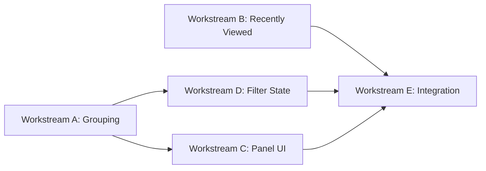

# Race Picker Panel: Modern Election Selection UX

## Problem

The current election selection UI has:

- A tiny `<select>` dropdown with 200+ options
- Separate search, category tabs, and year filter that don't feel integrated
- No grouping of related races (e.g., all Governor races across years)
- No "recently viewed" or quick access
- Poor mobile experience

## Solution: Race Picker Panel

Replace the dropdown with a **full panel** (inline on desktop, slide-up on mobile) that shows:

1. **Smart search** — type "gov" and see all Governor races grouped by year
2. **Filter chips** — Year and Category as tappable chips with counts (not buried dropdowns)
3. **Grouped results list** — races grouped by "race family" (Governor, State Rep District 61, etc.) with years as sub-items
4. **Recently viewed** — top 5 races the user looked at this session
5. **Responsive** — full-width slide-up panel on mobile; inline or collapsible on desktop

---

## UI Mockup (Text)

```
┌─────────────────────────────────────────────────────────────┐
│  🔍 Search races...                              [Clear]    │
├─────────────────────────────────────────────────────────────┤
│  YEAR:   [All] [2024] [2022]                                │
│  TYPE:   [All] [Federal 3] [State 45] [County 12] ...       │
├─────────────────────────────────────────────────────────────┤
│  RECENTLY VIEWED                                            │
│   • Governor (2024)                                         │
│   • US Senator (2024)                                       │
│   • County Commissioner Pct 4 (2022)                        │
├─────────────────────────────────────────────────────────────┤
│  ▾ FEDERAL (3)                                              │
│     President                                               │
│       └ 2024                                                │
│     US Senator                                              │
│       └ 2024  └ 2022                                        │
│     US Representative District 3                            │
│       └ 2024                                                │
│                                                             │
│  ▾ STATE (45)                                               │
│     Governor                                                │
│       └ 2024  └ 2022                                        │
│     State Senator District 8                                │
│       └ 2024  └ 2022                                        │
│     ...                                                     │
└─────────────────────────────────────────────────────────────┘
```

---

## Workstream Breakdown (5 Independent Tasks)

### Workstream A: Race Family Grouping Logic

**Owner:** One agent (pure JS, no UI)

**Files:** New `js/raceGrouping.js`

**Tasks:**

1. `getRaceFamily(entry)` — given a manifest entry, return a normalized "race family" key:
  - Strip year from name
  - Normalize punctuation and spacing
  - Keep district/precinct numbers
  - Examples: `Governor_2024.csv` → `Governor`, `State_Representative_District_61_2024.csv` → `State Representative District 61`
2. `groupElectionsByFamily(manifest)` — return a structure like:
  ```js
   {
     "Governor": { category: "State", entries: [{ filename, year, displayName }, ...] },
     "US Senator": { category: "Federal", entries: [...] },
     ...
   }
  ```
3. `sortFamilies(grouped, sortBy)` — sort race families alphabetically or by category; within each family, sort entries by year descending.
4. Unit tests in `js/raceGrouping.test.js`.

**No UI; exports pure functions.**

---

### Workstream B: Recently Viewed Manager

**Owner:** One agent (pure JS + localStorage)

**Files:** New `js/recentlyViewed.js`

**Tasks:**

1. `addRecentlyViewed(entry)` — add a manifest entry to the recently viewed list (max 5, dedupe by filename, most recent first). Store in `localStorage` under `ccd_recently_viewed`.
2. `getRecentlyViewed()` — return the list (array of manifest entries).
3. `clearRecentlyViewed()` — clear the list.
4. On page load, validate stored entries against current manifest (remove stale ones).
5. Unit tests.

**Integration point:** `electionView.js` calls `addRecentlyViewed(entry)` when a race is selected; the picker panel calls `getRecentlyViewed()` to show the section.

---

### Workstream C: Race Picker Panel Component

**Owner:** One agent (UI + wiring)

**Files:** New `js/racePickerPanel.js`, updates to `styles.css`

**Tasks:**

1. `createRacePickerPanel(options)` — returns a DOM element (or HTML string) for the panel:
  - Search input at top
  - Filter chips row (year, category) — receives available years and categories from caller
  - Recently viewed section (receives list from caller)
  - Grouped results list (receives grouped data from caller)
2. `renderGroupedList(groupedData, filters)` — render the grouped list; collapse/expand category headers; highlight matches when searching.
3. Event handling:
  - Search input: debounced, calls `onSearch(query)` callback
  - Filter chip click: calls `onFilterChange({ year, category })` callback
  - Race item click: calls `onSelect(entry)` callback
4. Accessibility: keyboard navigation (arrow keys in list, Enter to select, Escape to close), ARIA attributes.
5. CSS in `styles.css` under `.race-picker-*` classes:
  - Panel container (max-height, scrollable)
  - Search input styling
  - Filter chips (pill style, active state)
  - Recently viewed section (subtle background)
  - Grouped list (category headers, race items, year badges)
  - Hover/focus states
  - Responsive: on mobile (`max-width: 768px`), panel is fixed-position slide-up from bottom.

**Does not manage state directly; receives data and callbacks from the parent.**

---

### Workstream D: Filter and Search State Manager

**Owner:** One agent (extends existing filter manager)

**Files:** Updates to `js/electionFilters.js`

**Tasks:**

1. Add `searchQuery` state (already may exist; ensure debounced and consistent).
2. Add `getGroupedFilteredElections()` — applies current filters (year, category, search), then calls `groupElectionsByFamily()` from Workstream A, returns grouped + filtered data.
3. Add `getFilterCounts()` — returns counts per year and per category (for badge numbers on chips).
4. Ensure `onChange` callback fires when any filter changes so the panel can re-render.

**Integration:** The panel calls `filterManager.getGroupedFilteredElections()` to get data; `filterManager.setYear()`, `setCategory()`, `setSearchQuery()` to update filters.

---

### Workstream E: Integration into Election View

**Owner:** One agent (wiring)

**Files:** Updates to `js/electionView.js`, `index.html` (minimal), `styles.css` (minimal)

**Tasks:**

1. Replace the current `<select id="election-select">` with a **trigger button** that opens the Race Picker Panel:
  - Button shows the currently selected race name
  - Click opens the panel (inline or overlay depending on screen size)
2. Instantiate and wire the Race Picker Panel:
  - Pass `filterManager.getGroupedFilteredElections()` for grouped data
  - Pass `recentlyViewed.getRecentlyViewed()` for recently viewed section
  - Pass `filterManager.getFilterCounts()` for chip counts
  - On `onSelect(entry)`: call `loadAndRenderElection(map, entry.filename)`, call `recentlyViewed.addRecentlyViewed(entry)`, close panel, update trigger button label.
  - On `onFilterChange`: call `filterManager.setYear()` / `setCategory()`, re-render panel.
  - On `onSearch`: call `filterManager.setSearchQuery()`, re-render panel.
3. Remove or hide the old dropdown, search input, and filter tabs (the panel now contains all of these).
4. Update URL state: when race is selected, update hash; on page load, restore selected race and open panel if needed.
5. Mobile: ensure panel opens as slide-up overlay; close on backdrop click or swipe down.

---

## File Ownership (No Overlap)


| File                              | Owner                                  | Others                      |
| --------------------------------- | -------------------------------------- | --------------------------- |
| `js/raceGrouping.js` (new)        | Workstream A                           | B, C, D, E only import/use  |
| `js/raceGrouping.test.js` (new)   | Workstream A                           | —                           |
| `js/recentlyViewed.js` (new)      | Workstream B                           | C, E only import/use        |
| `js/recentlyViewed.test.js` (new) | Workstream B                           | —                           |
| `js/racePickerPanel.js` (new)     | Workstream C                           | E only imports              |
| `js/electionFilters.js`           | Workstream D                           | C, E call methods           |
| `js/electionView.js`              | Workstream E                           | —                           |
| `styles.css`                      | C (`.race-picker-*`), E (minor layout) | Use distinct class prefixes |


---

## Shared Contract

**Manifest entry shape** (already agreed):

```js
{ filename: string, year: number | null, category: string, displayName?: string }
```

**Grouped data shape** (from Workstream A):

```js
{
  "Race Family Name": {
    category: "State",
    entries: [{ filename, year, displayName }, ...]
  },
  ...
}
```

**Filter counts shape** (from Workstream D):

```js
{ years: { 2024: 45, 2022: 38 }, categories: { Federal: 3, State: 45, ... } }
```

---

## Dependency Order

1. **A (Grouping)** and **B (Recently Viewed)** can run in parallel — pure logic, no UI.
2. **D (Filter State)** depends on A for `groupElectionsByFamily`; can start in parallel if A exports a stub.
3. **C (Panel Component)** can start in parallel with A/B/D; receives data via callbacks.
4. **E (Integration)** runs last; imports A, B, C, D and wires everything together.




---

## Success Criteria

- User can find any race in under 3 seconds (search or 2 clicks)
- Recently viewed races are visible immediately
- Filtering by year/category updates the list instantly (no page reload)
- Mobile: panel slides up, easy to scroll and tap
- Keyboard users can navigate the entire picker
- No regression: existing URL state, trends, export, turnout simulator still work

