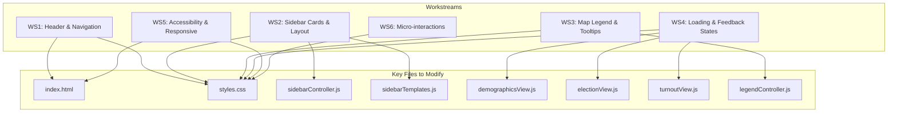

# Collin County Election Data - UI/UX Improvement Plan

## Current State Analysis

The application is a vanilla JavaScript election data visualization tool using Leaflet maps, Chart.js, and D3.js. The current UI is functional but has several areas for improvement:

**Identified Issues:**

- Basic visual hierarchy - headings and content blend together
- Limited visual feedback for interactions (hover, selection, loading states)
- Dense information presentation in sidebar
- Map legend is static and doesn't adapt to current view
- Mobile experience is basic (sidebar just hides)
- No skeleton loading states, causing layout shifts
- Color contrast could be improved for accessibility
- Limited micro-interactions and animations

---

## Architecture Overview




---

## Workstream 1: Header & Navigation Redesign

**Files:** `index.html`, `styles.css` (header section only)  
**No dependencies on other workstreams**

### Goals

- Add branding/logo placeholder
- Improve view toggle buttons with better active states
- Add subtle header shadow/gradient for depth
- Improve share button styling

### Changes

`**index.html` (lines 18-58):**

- Add logo container: `<div class="header-brand"><span class="header-logo">CC</span><span class="header-title">Collin County Elections</span></div>`
- Update view buttons to use icons alongside text

`**styles.css` - Add/modify:**

```css
/* Enhanced header with gradient */
#header-bar {
  background: linear-gradient(135deg, #004aad 0%, #002d6a 100%);
  box-shadow: 0 4px 12px rgba(0, 0, 0, 0.15);
}

/* View button improvements */
.view-btn {
  border-radius: 20px;
  padding: 8px 18px;
  transition: all 0.3s cubic-bezier(0.4, 0, 0.2, 1);
}

.view-btn.active {
  box-shadow: 0 2px 8px rgba(0, 0, 0, 0.2);
  transform: translateY(-1px);
}
```

---

## Workstream 2: Sidebar Card System & Layout

**Files:** `styles.css` (sidebar section), `sidebarTemplates.js`, `sidebarController.js`  
**No dependencies on other workstreams**

### Goals

- Implement consistent card-based design system
- Improve information hierarchy with better typography
- Add section dividers and spacing
- Create reusable card components

### Changes

**New card component styles in `styles.css`:**

```css
/* Card system */
.ui-card {
  background: #ffffff;
  border-radius: 12px;
  padding: 16px;
  margin-bottom: 16px;
  box-shadow: 0 1px 3px rgba(0, 0, 0, 0.08);
  border: 1px solid rgba(0, 0, 0, 0.05);
}

.ui-card-header {
  display: flex;
  align-items: center;
  gap: 12px;
  margin-bottom: 12px;
}

.ui-card-icon {
  width: 40px;
  height: 40px;
  border-radius: 10px;
  display: flex;
  align-items: center;
  justify-content: center;
}

/* Stat display improvements */
.stat-grid {
  display: grid;
  grid-template-columns: repeat(auto-fit, minmax(100px, 1fr));
  gap: 12px;
}

.stat-item {
  text-align: center;
  padding: 12px;
  background: #f8f9fa;
  border-radius: 8px;
}

.stat-value {
  font-size: 1.5rem;
  font-weight: 700;
  color: #002f6c;
}

.stat-label {
  font-size: 0.75rem;
  color: #666;
  text-transform: uppercase;
  letter-spacing: 0.5px;
}
```

**Update `sidebarTemplates.js`:**

- Create `createCard(title, icon, content)` template function
- Create `createStatGrid(stats)` template function
- Wrap existing content in card containers

---

## Workstream 3: Map Legend & Tooltip Improvements

**Files:** `styles.css` (legend section), `legendController.js`, `index.html` (legend markup)  
**No dependencies on other workstreams**

### Goals

- Make legend dynamic based on current view
- Add gradient bars for continuous scales
- Improve tooltip design with better contrast
- Add "flipped precinct" indicator to legend when simulation active

### Changes

**Enhanced legend in `styles.css`:**

```css
.map-legend {
  background: rgba(255, 255, 255, 0.96);
  backdrop-filter: blur(8px);
  border-radius: 12px;
  box-shadow: 0 4px 16px rgba(0, 0, 0, 0.12);
  padding: 14px 18px;
}

.legend-gradient-bar {
  height: 12px;
  border-radius: 6px;
  margin: 8px 0;
}

/* Improved tooltips */
.leaflet-tooltip {
  background: rgba(33, 33, 33, 0.95);
  backdrop-filter: blur(4px);
  border: none;
  border-radius: 8px;
  padding: 10px 14px;
  box-shadow: 0 4px 12px rgba(0, 0, 0, 0.25);
}
```

**Update `legendController.js`:**

- Add `updateLegendForView(viewType)` function
- Add gradient bar generation for turnout view
- Add flipped precinct indicator when simulation is active

---

## Workstream 4: Loading States & Feedback

**Files:** `styles.css` (loading section), `demographicsView.js`, `electionView.js`, `turnoutView.js`  
**No dependencies on other workstreams**

### Goals

- Add skeleton loading placeholders
- Improve loading spinner design
- Add progress indicators for data loading
- Better empty/error states

### Changes

**Skeleton loaders in `styles.css`:**

```css
/* Skeleton loading */
.skeleton {
  background: linear-gradient(
    90deg,
    #f0f0f0 25%,
    #e0e0e0 50%,
    #f0f0f0 75%
  );
  background-size: 200% 100%;
  animation: skeleton-shimmer 1.5s infinite;
  border-radius: 4px;
}

@keyframes skeleton-shimmer {
  0% { background-position: 200% 0; }
  100% { background-position: -200% 0; }
}

.skeleton-text { height: 16px; margin: 8px 0; }
.skeleton-title { height: 24px; width: 60%; }
.skeleton-card { height: 120px; }

/* Enhanced spinner */
.loading-spinner {
  width: 40px;
  height: 40px;
  border: 3px solid #f0f0f0;
  border-top-color: #004aad;
  border-radius: 50%;
  animation: spin 0.8s linear infinite;
}
```

**Update view files:**

- Add `renderSkeletonState()` function to each view
- Call skeleton state before data loads
- Add fade-in transition when content loads

---

## Workstream 5: Accessibility & Responsive Improvements

**Files:** `index.html`, `styles.css` (responsive section)  
**No dependencies on other workstreams**

### Goals

- Improve color contrast ratios
- Add proper focus indicators
- Enhance keyboard navigation
- Better mobile layout with slide-out sidebar

### Changes

`**index.html`:**

- Add skip link: `<a href="#main-container" class="skip-link">Skip to main content</a>`
- Ensure all interactive elements have proper `aria-label`
- Add `role="region"` to sidebar and map

**Accessibility styles in `styles.css`:**

```css
/* Focus indicators */
:focus-visible {
  outline: 3px solid #FFC800;
  outline-offset: 2px;
}

button:focus-visible,
a:focus-visible {
  box-shadow: 0 0 0 3px rgba(255, 200, 0, 0.5);
}

/* High contrast mode support */
@media (prefers-contrast: high) {
  .view-btn { border-width: 3px; }
  .legend-swatch { border: 2px solid #000; }
}

/* Mobile slide-out sidebar */
@media (max-width: 800px) {
  #sidebar {
    position: fixed;
    transform: translateX(-100%);
    transition: transform 0.3s ease;
    z-index: 500;
  }
  
  #sidebar.open {
    transform: translateX(0);
  }
  
  .sidebar-overlay {
    position: fixed;
    inset: 0;
    background: rgba(0, 0, 0, 0.5);
    z-index: 499;
  }
}
```

---

## Workstream 6: Micro-interactions & Polish

**Files:** `styles.css` (animations section)  
**No dependencies on other workstreams**

### Goals

- Add subtle hover animations
- Smooth transitions between states
- Button press feedback
- Content reveal animations

### Changes

**Animation utilities in `styles.css`:**

```css
/* Transition utilities */
.transition-fast { transition: all 0.15s ease; }
.transition-medium { transition: all 0.25s ease; }
.transition-slow { transition: all 0.4s ease; }

/* Hover lift effect */
.hover-lift:hover {
  transform: translateY(-2px);
  box-shadow: 0 4px 12px rgba(0, 0, 0, 0.15);
}

/* Press effect */
.press-effect:active {
  transform: scale(0.98);
}

/* Content fade-in */
.fade-in {
  animation: fadeIn 0.3s ease forwards;
}

@keyframes fadeIn {
  from { opacity: 0; transform: translateY(8px); }
  to { opacity: 1; transform: translateY(0); }
}

/* Staggered list animation */
.stagger-item {
  opacity: 0;
  animation: fadeIn 0.3s ease forwards;
}

.stagger-item:nth-child(1) { animation-delay: 0.05s; }
.stagger-item:nth-child(2) { animation-delay: 0.1s; }
.stagger-item:nth-child(3) { animation-delay: 0.15s; }
/* ... etc */
```

---

## Workstream Dependencies & Parallelization

```mermaid
gantt
    title Workstream Parallelization
    dateFormat X
    axisFormat %s
    
    section Independent
    WS1 Header & Nav     :ws1, 0, 3
    WS2 Sidebar Cards    :ws2, 0, 4
    WS3 Legend & Tooltips:ws3, 0, 3
    WS4 Loading States   :ws4, 0, 3
    WS5 Accessibility    :ws5, 0, 4
    WS6 Micro-interactions:ws6, 0, 2
    
    section Integration
    Final Polish & QA    :after ws1 ws2 ws3 ws4 ws5 ws6, 1
```




**All 6 workstreams can run in parallel** because:

- WS1 touches only header CSS/HTML
- WS2 touches only sidebar-specific CSS and template files
- WS3 touches only legend-specific CSS and legendController
- WS4 adds new loading styles and updates view render functions
- WS5 adds accessibility attributes and responsive styles
- WS6 adds animation utilities (non-conflicting with other styles)

---

## Implementation Notes

- Each workstream should create styles in **clearly commented sections** of `styles.css`
- Use **CSS custom properties** for shared values (colors, spacing)
- Test each workstream independently before merging
- Final integration phase should resolve any CSS specificity conflicts

---

## Final Integration Complete

**Status:** All 6 workstreams fully integrated and tested.

### Integration Summary

#### WS1: Header & Navigation

- Header brand with `CC` logo implemented
- View toggle buttons with pill shape, hover effects, and active states
- Gradient background with box-shadow for depth
- Share button with copy-to-clipboard functionality
- Mobile hamburger menu toggle

#### WS2: Sidebar Card System

- `createCard()` and `createCardWithSubtitle()` template functions
- `createStatGrid()` for statistics display
- `createDivider()` for section separation
- Icon library (`ICONS` object) for consistent iconography
- All views updated to use card components

#### WS3: Map Legend & Tooltips

- Dynamic legend updates via `updateLegendForView()` function
- Gradient bars for turnout view
- Glassmorphism effect on legend container
- Flipped precinct indicator when simulation is active
- Enhanced tooltips with better contrast and styling

#### WS4: Loading States & Feedback

- `skeletonLoader.js` module with comprehensive skeleton variants
- `createSkeletonStatGrid()`, `createSkeletonList()`, etc.
- View-specific skeletons (demographics, election, turnout)
- `fadeInContent()` for smooth content transitions
- Error and empty state handlers

#### WS5: Accessibility & Responsive

- Skip link for keyboard navigation
- Proper ARIA attributes on all interactive elements
- `:focus-visible` indicators with high-visibility yellow outline
- High contrast mode support (`prefers-contrast: high`)
- Mobile slide-out sidebar with overlay
- Touch target size adjustments for mobile
- Escape key closes mobile sidebar

#### WS6: Micro-interactions

- Transition utilities (`.transition-fast`, `.transition-medium`)
- Hover lift effects (`.hover-lift`, `.hover-lift-subtle`)
- Press effects (`.press-effect`)
- Fade-in animations (`.fade-in`, `.fade-in-up`, etc.)
- Staggered list animations (`.stagger-item`)
- Scale animations (`.scale-in`, `.pop-in`)
- Reduced motion support (`prefers-reduced-motion: reduce`)

### Test Results

- **14 test suites passed**
- **795 tests passed**
- No linter errors

### Files Modified


| File                      | Changes                                                           |
| ------------------------- | ----------------------------------------------------------------- |
| `index.html`              | Added skip link, ARIA attributes, mobile toggle, sidebar overlay  |
| `styles.css`              | 4550+ lines with all workstream styles organized in sections      |
| `js/app.js`               | Mobile sidebar toggle, ARIA state management, keyboard navigation |
| `js/skeletonLoader.js`    | Complete skeleton loading system                                  |
| `js/sidebarTemplates.js`  | Card-based design system components                               |
| `js/sidebarController.js` | Updated to use new card system                                    |
| `js/legendController.js`  | Dynamic legend generation per view                                |
| `js/demographicsView.js`  | Skeleton loading, fade-in animations                              |
| `js/electionView.js`      | Skeleton loading, staggered animations, error states              |
| `js/turnoutView.js`       | Skeleton loading, leaderboard with animations                     |


### Bug Fixes During Integration

1. Fixed mobile sidebar toggle ID mismatch (`mobile-sidebar-toggle` → `sidebar-toggle`)
2. Added overlay click and Escape key handlers for mobile sidebar

### QA Verification

- All interactive elements have proper focus indicators
- Animations respect `prefers-reduced-motion`
- Mobile sidebar slides in/out correctly with overlay
- Skeleton loaders display while data loads
- Toast notifications work for copy link
- Legend updates dynamically per view

